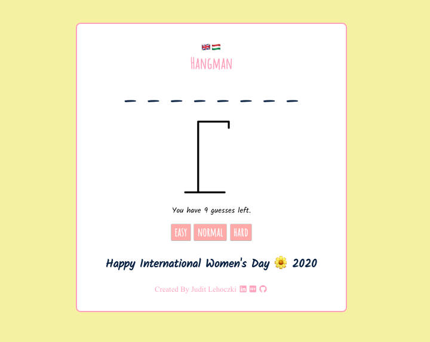

## The Classic Hangman Game

This is a baby project of mine that I created on the fourth day of my journey on learning React. It is themed for International Women's Day and is playable both in English and Hungarian. This is a desktop app so will not work from a mobile phone.
The game is available to play [here](https://friendly-elion-692a1c.netlify.com/) but if you want to play around with the code please feel free to download it.

## Download

- Fork and clone the repository to your computer
- `yarn install`
- `yarn start`
  - Runs the app in the development mode. Open [http://localhost:3000](http://localhost:3000) to view it in the browser.
  - The page will reload if you make edits. You will also see any lint errors in the console.

## Screenshot

### Built With

- [React](https://reactjs.org/)

### Future Work

- add a visual keyboard
- add word categories to choose from, maybe hints
- further languages
- extend word-base
